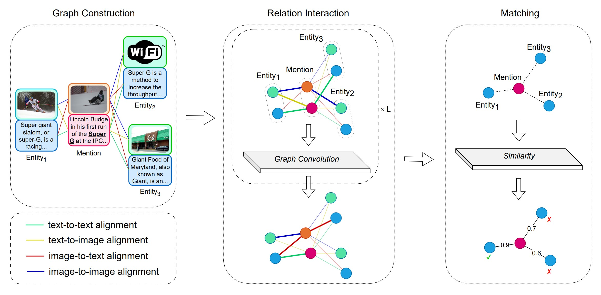

# DRIN

Code and data for ACMMM'23 paper [DRIN: A Dynamic Relation Interactive Network for Multimodal Entity Linking](https://arxiv.org/abs/2310.05589).



If you find this helpful, please cite our paper.

```
@misc{xing2023drin,
    title={DRIN: Dynamic Relation Interactive Network for Multimodal Entity Linking},
    author={Shangyu Xing and Fei Zhao and Zhen Wu and Chunhui Li and Jianbing Zhang and Xinyu Dai},
    year={2023},
    eprint={2310.05589},
    archivePrefix={arXiv},
    primaryClass={cs.CL}
}
```

## Requirements

You will need 10GB+ VRAM, 100GB+ RAM and 100GB+ disk storage (1TB+ if processing raw data) to run this efficiently. It is recommended to use python 3.8. Pip requirements are provided in `./requirements.txt`.

## Data

We use two datasets to evaluate out model: WikiMEL and WikiDiverse. However, they do not provide complete entity images (our method requires at least one image for each candidate entity). So, we search Wikidata for additional images to construct our datasets. We also open-source the scripts we use, which can be found on https://github.com/starreeze/drin-dataset.

Anyway, reproducing our results don't need these scripts. You can access the constructed data on https://www.aliyundrive.com/s/XxehAa6ZvVw (extract code: e81p). We use the fake MP4 format to store the data as the storage provider has set restrictions on sharing zip files. After downloading the mp4 files, put it under the `./dataset` directory. Then run the following script:

```shell
cd dataset
python data_tools.py \
    --raw_files preprocessed.tar.gz raw-data.z01 raw-data.z02 raw-data.z03 raw-data.z04 raw-data.z05 raw-data.zip \
    --encoded_files preprocessed.mp4 raw-data-1.mp4 raw-data-2.mp4 raw-data-3.mp4 raw-data-4.mp4 raw-data-5.mp4 raw-data-6.mp4
```

It will convert the data back to the zipped format and verify md5 checksums. Then unzip the files as usual.

### Preprocessed data

You can directly use our preprocessed data (recommended).
Download and unzip the processed data `preprocessed.mp4`, and modify the value of `preprocess_dir` in `common/args.py`. It should look like this:

```
<preprocess_dir>/
├── wikidiverse/ [54 files in total]
│   ├── answer_test.npy
│   ├── answer_train.npy
│   ├── answer_valid.npy
│   ├── end-pos_test.npy
│   ├── ...
└── wikimel/ [45 files in total]
    ├── answer_test.npy
    ├── answer_train.npy
    ├── answer_valid.npy
    ├── end-pos_test.npy
    ├── ...
```

### Raw Data

Otherwise, if you insist on using the raw data, you can download and unzip them `raw-data-*.mp4`, and modify the value of `dataset_root` and `default_image` in `common/args.py`. It should look like this:

```
<dataset_root>/
├── default.jpg
├── wikidiverse/
│   ├── candidates/
│   │   ├── test_w_10cands.json
│   │   ├── train_w_10cands.json
│   │   └── valid_w_10cands.json
│   ├── entities/
│   │   ├── entity2brief_test.json
│   │   ├── entity2brief_train.json
│   │   ├── entity2brief_valid.json
│   │   ├── wikipedia_entity2desc_filtered.tsv
│   │   └── wikipedia_entity2imgs.tsv
│   ├── images/ [182684 entries exceeds filelimit, not opening dir]
│   └── mentions/
│       ├── test.json
│       ├── train.json
│       └── valid.json
└── wikimel/
    ├── candidates/
    │   ├── ne2qid.json
    │   ├── qid2ne.json
    │   └── top100/
    │       ├── all-qids.txt
    │       ├── candidates-answer.tsv
    │       └── candidates.tsv
    ├── entities/
    │   ├── cleaned-images/ [788403 entries exceeds filelimit, not opening dir]
    │   ├── qid2abs.json
    │   ├── qid2brief.json
    │   └── qid-entity.tsv
    └── mentions/
        ├── KVQAimgs [24602 entries exceeds filelimit, not opening dir]
        ├── WIKIMEL_test.json
        ├── WIKIMEL_train.json
        └── WIKIMEL_valid.json
```

Some preprocessing scripts are provided in `./preprocess` for your convenience. You can run it sequentially via

```shell
python preprocess/prepare.py
python preprocess/bert.py
python preprocess/resnet.py
python preprocess/clip.py
```

The processed data will be written to `preprocess_dir`. Note that this is needed for each dataset. Modify the value of `dataset_name` in `common/args.py` and run all the above again for a different dataset.

## Train DRIN

Just run:

```shell
python train.py
```

It will train, validate and test the model and output the results.

See `common/args.py ### train` for super-parameters.

## Baselines

We reimplemented some baselines in `./baselines`. Modify `model_type` in `common/args.py` and run the train scripts to see the reproduced results.
